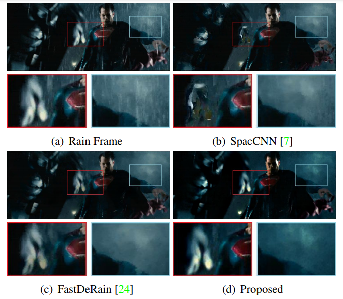

## Frame-Consistent Recurrent Video Deraining with Dual-Level Flow (CVPR'2019)

[Wenhan Yang](https://flyywh.github.io/index.html), 
[Jiaying Liu](http://www.icst.pku.edu.cn/struct/people/liujiaying.html),
and [Jiashi Feng](https://sites.google.com/site/jshfeng/home)

[[Paper Link]](http://39.96.165.147/Pub%20Files/2019/ywh_cvpr19.pdf)
[[Project Page]](https://github.com/flyywh/Dual-FLow-Video-Deraining-CVPR-2019)

### Abstract

In this paper, we address the problem of rain removal from videos by proposing a more comprehensive framework that considers the additional degradation factors in real scenes neglected in previous works. The proposed framework is built upon a two-stage recurrent network with duallevel flow regularizations to perform the inverse recovery process of the rain synthesis model for video deraining. The rain-free frame is estimated from the single rain frame at the first stage. It is then taken as guidance along with previously recovered clean frames to help obtain a more accurate clean frame at the second stage. This two-step architecture is capable of extracting more reliable motion information from the initially estimated rain-free frame at the first stage for better frame alignment and motion modeling at the second stage. Furthermore, to keep the motion consistency between frames that facilitates a frame-consistent deraining model at the second stage, a dual-level flow based regularization is proposed at both coarse flow and fine pixel levels. To better train and evaluate the proposed video deraining network, a novel rain synthesis model is developed to produce more visually authentic paired training and evaluation videos. Extensive experiments on a series of synthetic and real videos verify not only the superiority of the proposed method over state-of-the-art but also the effectiveness of network design and its each component.

#### If you find the resource useful, please cite the following :- )

```
@ARTICLE{Yang_2019_CVPR_Dual_Flow,
  author={Yang, Wenhan and Liu, Jiaying and Feng, Jiashi},
  booktitle={2019 IEEE/CVF Conference on Computer Vision and Pattern Recognition (CVPR)}, 
  title={Frame-Consistent Recurrent Video Deraining With Dual-Level Flow}, 
  year={2019},
  volume={},
  number={},
  pages={1661-1670},
  doi={10.1109/CVPR.2019.00176}}
```
 

## Journal Extension
We further have a submitted journal version: [[Journal Submission]](https://github.com/flyywh/Recurrent-Multi-Frame-Deraining)

## Installation:
(TBD)


## Contact

If you have questions, you can contact `yangwenhan@pku.edu.cn`.
A timely response is promised, if the email is sent by your affliaton email with your signed name.
